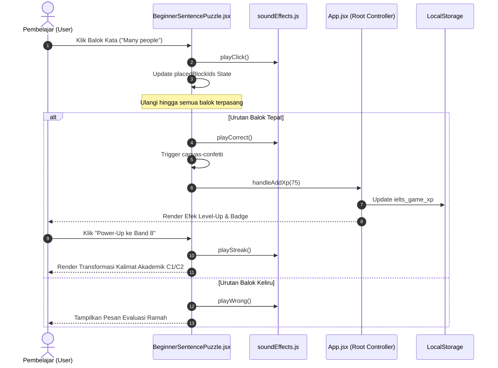

# 03. SYSTEM ARCHITECTURE AND DESIGN (SDD)
## Berdasarkan Standar IEEE 1016-2009 (Software Design Description)
### Proyek: IELTS Writing Band 8 Master (GameWriting)

---

## 1. Ikhtisar Arsitektur Sistem

Sistem *IELTS Writing Band 8 Master* dirancang dengan pola arsitektur **Component-Driven Layered Architecture** pada lingkungan *Single Page Application* (SPA) berbasis teknologi **React 19**, **Vite**, dan **Tailwind CSS v4**. Pola ini menjamin pemisahan tanggung jawab (*Separation of Concerns*) yang bersih antara antarmuka visual, logika diagnostik pedagogis, pemrosesan audio sintetis, dan lapisan persistensi data.

```mermaid
graph TD
    subgraph UI_Presentation_Layer ["1. UI & Presentation Layer"]
        A[App.jsx - Shell Router]
        B1[Navbar.jsx - Gamification HUD]
        B2[BeginnerSentencePuzzle.jsx - Lego Blocks]
        B3[SkillTree.jsx - 5-Tier Roadmap]
        B4[SentenceTransformerGame.jsx]
        B5[CollocationDrill.jsx]
        B6[Task1ChartLab.jsx]
        B7[GeneralTrainingLetterLab.jsx]
        B8[Task2EssayBuilder.jsx]
        B9[BandCalculatorModal.jsx]
        B10[SettingsModal.jsx]
    end

    subgraph Domain_Pedagogical_Layer ["2. Domain & Pedagogical Engine Layer"]
        C1[band8Analyzer.js - Heuristic Evaluator]
        C2[geminiApi.js - LLM Client Engine]
        C3[beginnerLessonsData.js - Scaffolding Matrix]
        C4[generalTrainingData.js - Letter Corpus]
        C5[curriculumData.js - Tier 1 to 5 Syllabus]
        C6[sentenceTransformerData.js - C1/C2 Pairs]
    end

    subgraph Service_Infrastructure_Layer ["3. Core Services & Audio Engine"]
        D1[soundEffects.js - Web Audio API Synthesizer]
        D2[canvas-confetti - Visual Reward Engine]
    end

    subgraph Persistence_Layer ["4. Persistence & Storage Layer"]
        E1[(Browser LocalStorage)]
        E2[Google Gemini REST Endpoint via HTTPS]
    end

    A --> B1
    A --> B2
    A --> B3
    A --> B4
    A --> B5
    A --> B6
    A --> B7
    A --> B8
    
    B2 --> C3
    B4 --> C6
    B5 --> C5
    B6 --> C5
    B7 --> C4
    B8 --> C1
    B8 --> C2
    
    B1 --> D1
    B2 --> D1
    B2 --> D2
    B8 --> D1
    B8 --> D2
    
    A --> E1
    C2 --> E2
```

---

## 2. Rincian Lapisan Arsitektur (Architectural Layers)

### 2.1. Presentation Layer (Antarmuka Pengguna)
- **Komponen Inti**: `App.jsx` bertindak sebagai *Root State Controller* yang mengelola status navigasi antar tab, sinkronisasi skor XP, level, dan visibilitas modal dialog.
- **Komponen Spesialisasi**:
  - `BeginnerSentencePuzzle.jsx`: Mengelola state pemilihan balok kata, validasi urutan array kata, dan penyajian *Band 8 Power-Up*.
  - `GeneralTrainingLetterLab.jsx`: Mengelola pemilihan tipe surat (Formal/Semi/Informal), injeksi frasa dari bank leksikal, serta penghitungan jumlah kata surat.
  - `Task2EssayBuilder.jsx`: Mengelola kanvas penulisan esai, *real-time text debounce*, countdown timer ujian 40 menit, dan panel arsitektur PEEL.

### 2.2. Domain & Pedagogical Logic Layer
- **`band8Analyzer.js`**:
  - Mesin *Natural Language Processing* (NLP) berbasis aturan heuristik di sisi klien.
  - Mengonversi teks input menjadi token leksikal, mendeteksi *weak words* melalui pencocokan kamus terkompilasi, menghitung rasio kalimat sederhana vs kompleks vs tingkat lanjut, dan mengestimasi skor Band IELTS secara deterministik.
- **`geminiApi.js`**:
  - Mengelola komunikasi asinkron langsung dari peramban ke endpoint `generativelanguage.googleapis.com` dengan instruksi sistem *Senior IELTS Examiner* dan skema respon JSON terstruktur.

### 2.3. Audio & Reward Engine (`soundEffects.js`)
- Mengimplementasikan pola *Singleton Controller* dengan memanfaatkan modul bawaan peramban `window.AudioContext`.
- Mengeliminasi kebutuhan mengunduh berkas audio MP3/WAV eksternal berukuran besar dengan langsung mensintesis gelombang frekuensi audio (*sine, triangle, sawtooth oscillators*) secara dinamis:
  - *Tone Chime*: 523.25Hz -> 659.25Hz -> 783.99Hz (Respon Benar).
  - *Fanfare Arpeggio*: 523.25Hz -> 659.25Hz -> 783.99Hz -> 1046.5Hz (Naik Tingkat/Level Up).
  - *Low Buzz*: 220Hz -> 196Hz (Respon Salah Lembut).

### 2.4. Persistence Layer (Penyimpanan Status)
- Menggunakan `window.localStorage` dengan skema kunci terisolasi:
  - `ielts_game_xp`: Bilangan bulat total XP yang terkumpul.
  - `ielts_game_streak`: Bilangan bulat jumlah hari belajar berturut-turut.
  - `ielts_game_drills`: Array ID latihan yang telah dituntaskan pengguna.
  - `ielts_gemini_api_key`: Kunci API pengguna yang tersimpan lokal secara terenkripsi di sandbox peramban.

---

## 3. Diagram Interaksi Antar Komponen (Sequence Diagram)

Berikut alur eksekusi saat pengguna pemula menyusun balok kata pada modul *Sentence Puzzle*:

