# 08. CI/CD PIPELINE AND DEVOPS SPECIFICATION
## Arsitektur Continuous Integration & Continuous Deployment (GitHub Actions)
### Proyek: IELTS Writing Band 8 Master (GameWriting)

---

## 1. Ikhtisar DevOps & Filosofi CI/CD

Untuk memastikan perangkat lunak selalu berada dalam kondisi siap rilis (*production-ready*) dan setiap pembaruan kode teruji secara otomatis tanpa regresi, proyek ini menerapkan kerangka kerja **Continuous Integration (CI)** dan **Continuous Deployment (CD)** berbasis **GitHub Actions**.

```mermaid
flowchart LR
    subgraph Developer_Workspace ["1. Local Development"]
        A[Git Commit] --> B[Git Push to GitHub]
    end

    subgraph CI_Pipeline ["2. Continuous Integration (CI Runner)"]
        B --> C[Checkout Code]
        C --> D[Setup Node.js 22 & Cache]
        D --> E[Install Dependencies npm install]
        E --> F[Run Automated Unit Tests npm test]
        F --> G[Compile Vite Production Build]
    end

    subgraph CD_Pipeline ["3. Continuous Deployment (CD)"]
        G --> H[Package dist Artifacts]
        H --> I[Deploy to GitHub Pages]
        I --> J[Live Production URL]
    end
```

---

## 2. Struktur Pipeline GitHub Actions (`.github/workflows/ci-cd.yml`)

### 2.1. Pemicu Pipeline (Triggers)
- **Push Event**: Setiap perubahan pada cabang `main` atau `master`.
- **Pull Request**: Validasi otomatis terhadap setiap permintaan penggabungan cabang (*PR verification*).
- **Manual Trigger (`workflow_dispatch`)**: Kemampuan memicu build dan rilis secara manual dari dasbor GitHub.

### 2.2. Tahap Continuous Integration (Job: `build-and-test`)
1. **Environment Setup**: Berjalan pada mesin virtual Ubuntu terbaru (`ubuntu-latest`) dengan runtime **Node.js v22 LTS** dan pengoptimalan cache paket npm.
2. **Automated Testing**: Menjalankan test runner bawaan Node.js (`node --test tests/analyzer.test.js`) untuk memvalidasi:
   - Evaluasi teks kosong dan inisialisasi default.
   - Ketepatan deteksi kata lemah (*weak words*) dan leksikon akademik AWL.
   - Formulasi rasio kompleksitas struktur kalimat.
3. **Compilation Check**: Menjalankan `npm run build` menggunakan Vite untuk memverifikasi ketiadaan kesalahan sintaksis, pemformatan CSS, dan *bundling asset*.

### 2.3. Tahap Continuous Deployment (Job: `deploy`)
1. **Artifact Ingestion**: Mengambil bundel statis dari folder `dist/`.
2. **Zero-Downtime Deployment**: Mengunggah artefak ke infrastruktur **GitHub Pages** menggunakan action resmi `actions/deploy-pages@v4`.
3. **URL Produksi**: Aplikasi langsung dapat diakses secara publik pada domain GitHub Pages:
   `https://abunabiha.github.io/IELT-Writing-Study/`

---

## 3. Keamanan & Kebijakan Hak Akses (Permissions & Secrets)

- **Minimal Privilege Principle**:
  - `contents: read`: Hanya membaca kode sumber.
  - `pages: write`: Hak menulis khusus deployment GitHub Pages.
  - `id-token: write`: Diperlukan untuk autentikasi OpenID Connect (OIDC) GitHub Pages.
- **Client-Side Secret Isolation**: Kunci API Google Gemini milik pengguna **TIDAK** disimpan di repositori Git atau file rahasia CI/CD, melainkan dimasukkan secara mandiri oleh pengguna di menu pengaturan browser lokal (`localStorage`).
